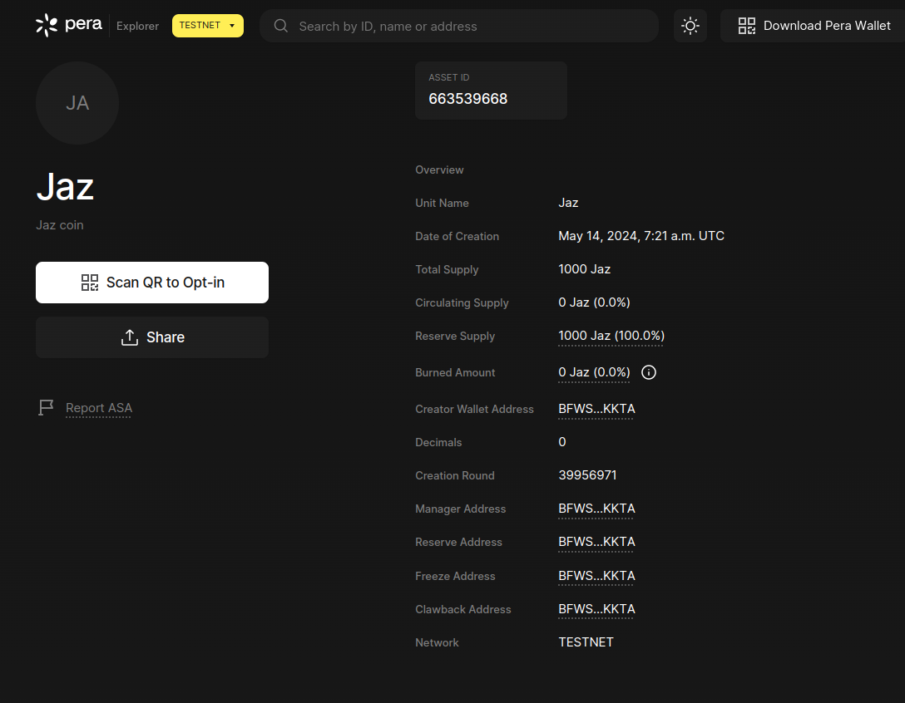

# token-algorand

## About

`Why Algorand?`

 **Algorand is the Layer-1 protocol that supports developing dApps, uses the Pure Proof of Stake (PPoS) consensus mechanism, is a sustainable green blockchain, and is also in partnership with ClimateTrade. It is energy efficient as compared to other blockchains.Not only this, Algorand is fast, secure, and scalable: Algorand smart contracts operate at over 1,000 TPS (transaction per second).**

 _Algorand is an exciting new blockchain technology that offers decentralization, scalability, security, and environmental sustainability. The Algorand Virtual Machine (AVM) and Algorand Standard Assets (ASA) are two key features that make Algorand stand out among other blockchains._

### Getting started

```sh
# install prerequisites and setup
# init package.json
npm init -y
# insall algosdk
npm install algosdk
# list algosdks
npm list algosdk # should see something like this =>  algosdk@2.7.0
```

## `Generating account details`

```sh
cd token
node CreateAccount.js
# The `passphrase/mnemonic`, `privateKey` and `address` will be generated
```

## `Creating asset`

```sh
cd token
node CreateAsset.js
```

`After running task, you should see something like this`

```sh
Creating token Metadata....
Token deployed successfully!!
Asset ID created: 663539668
Asset Url: https://testnet.explorer.perawallet.app/asset/663539668
```

```sh
# click the token link in the console
# It is in format of this
https://testnet.explorer.perawallet.app/asset/<Your_assetID>

```
## `After, click the token link and you should see something like this`



---------

@0xJonaseb11
